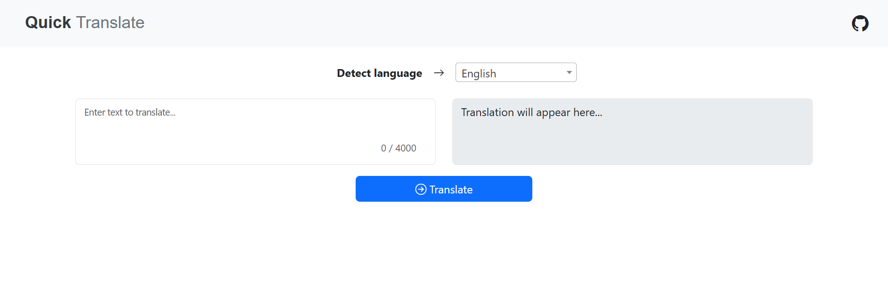

# Quick-Translate

  
*A sleek and responsive web app for instant language translation.*

🔗 **Live Demo:** [Visit Quick Translate](https://quick-translate.onrender.com/)

---

## ✨ Features

- 🔤 Translate between 130+ languages
- 🌐 Auto-detect input language
- ⚡ Instant, accurate translations
- 📱 Mobile-friendly and responsive UI
- 📋 One-click copy to clipboard

---

## 🚀 How to Use

1. Type or paste text in the input box.
2. Choose source and target languages (or use auto-detect).
3. Click **Translate**.
4. Copy the translated result with one click.

---

## 🛠️ Tech Stack

- **Frontend:** HTML, CSS (Bootstrap), JavaScript
- **Backend:** Django (Python)
- **Python libraries:**
  - **deep_translator**  for translation
  - **py3langid**  for language detection

---

## ⚙️ Setup Instructions

```bash
# Clone the repository
git clone https://github.com/yourusername/quick-translate.git
cd quick-translate

# Create and activate a virtual environment
python -m venv venv
source venv/bin/activate  # Windows: venv\Scripts\activate

# Install required packages
pip install -r requirements.txt

# Run the development server
python manage.py runserver

